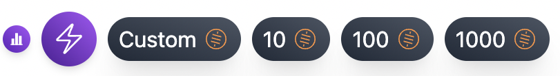

<p align="center">
  
</p>

# zap-button

React component that allows you to integrate a zap button into your web application, and help zap people on nostr using their lightning address.

⚠️ Best used alongside [Bitcoin Connect](https://github.com/getAlby/bitcoin-connect)

## 🚀 Quick Start

```
npm install @getalby/zap-button
```

## 🤙 Usage

### `ZapButton`


```jsx
import React, { useEffect, useState } from 'react';
import { Button, Modal } from '@getalby/bitcoin-connect-react';
import { ZapButton } from 'zap-button';

const MyComponent = () => {
  const lnurl = 'hello@getalby.com';
  const [connected, setConnected] = useState(false)

  useEffect(() => {
    window.addEventListener("bc:connected", () => {
      setConnected(true)
    });
  }, [])

  return (
    <div>
      <h1>My Zapping App</h1>
      <div>
        <Modal />
        <Button />
      </div>

      <ZapButton lnurl={lnurl} activate={connected}/>
    </div>
  );
};

export default MyComponent;
```

And Zap Button component would be embedded like this:



## Thanks

@bigyanpoudel for https://github.com/bigyanpoudel/react-vite-library